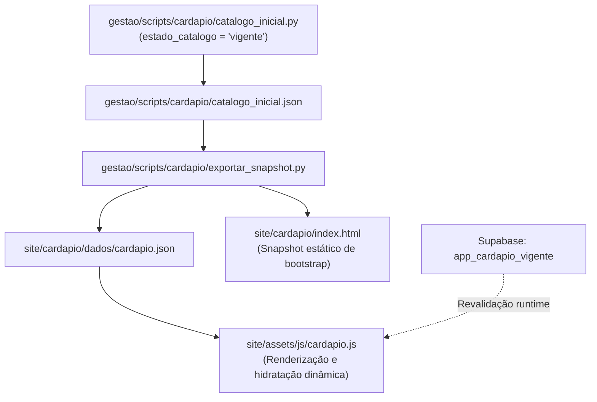

# Handoff — Publicação do Cardápio Próprio, UI/UX e Acervo Visual

Atualizado em 28/09/2026 por Antigravity.
Este documento consolida a arquitetura, as decisões de design, a esteira de dados e o estado de produção da virada do cardápio próprio em `sirfisher.com.br/cardapio/`.

---

## 1. Visão Geral e Contexto da Virada

O cardápio digital do Sir Fisher foi oficialmente publicado em produção no portal próprio (`/cardapio/`), deixando de ser um protótipo em conferência e assumindo o papel de catálogo oficial acessível via web, QR code e campanhas de tráfego (ex: ChatGPT Ads / Google Maps).

- **Status do Catálogo:** `vigente` (versão 1).
- **Destino Oficial:** substitui os links externos para plataformas de terceiros (Hubt), mantendo a navegação e a identidade sob controle da marca Sir Fisher.
- **Relação com Almoço Executivo:** `almoco-executivo/index.html` permanece temporariamente como página focada nos pratos individuais executivos, com seus próprios ativos e links específicos.

---

## 2. Limpeza Editorial e Remoção de Avisos Transitórios

Todas as marcações e avisos internos de conferência que existiam durante o período de validação inicial foram definitivamente eliminados da interface pública:

1. **Banners e avisos de conferência removidos:**
   - *"Cardápio em conferência. Confirme preços e porções com a equipe."* (tarja amarela no topo).
   - *"Marcações transcritas do cardápio impresso, ainda não conferidas com a cozinha. Consulte a equipe sobre alérgenos."* (notas de rodapé de modais).
   - Mensagens de porção/volume não cadastrados (*"Ainda não temos a medida cadastrada para este item..."*).
   - Mensagem de rodapé com data de snapshot legado (*"cardápio carregado da cópia salva em 22/09/2026."*).
2. **Remoção de "Como pedir":**
   - O bloco *"Como pedir"* foi completamente expurgado da exibição das modais de produto.
3. **Limpeza de anotações internas de produto:**
   - Notas internas de conferência (ex.: observações de destilaria em `sherlock-holmes-gin`) foram limpas dos objetos exportados.

---

## 3. Avisos Institucionais, Legais e Alérgenos (Rodapé)

O cardápio incorporou os avisos originais da operação física e as exigências legais do setor de alimentação fora do lar:

- **Política de Cheques:** *"Não aceitamos cheques."*
- **Taxa de Serviço:** *"Taxa de serviço de 10% opcional, conforme Lei Federal nº 13.419/2017."*
- **Defesa do Consumidor:** Contatos diretos de proteção ao consumidor:
  - **DECON-CE:** (85) 3499-7950
  - **PROCON Fortaleza:** 151
- **Meios de Pagamento:** Cartões de crédito e débito (Visa, Mastercard, Elo, Hipercard, American Express) e Pix.
- **Aviso de Alérgenos (Contaminação Cruzada):** Texto redigido no padrão natural de rotulagem da indústria de alimentos:
  > *"Alérgicos: Todos os nossos pratos e bebidas são preparados em cozinha compartilhada e podem conter glúten, camarão, crustáceos, leite, ovos, soja e peixes devido à contaminação cruzada."*

---

## 4. Evolução de UI/UX

### A. Abas de Categorias Estilo iFood (Horizontal Scroll)
- Implementada barra de navegação horizontal com scroll suave (`.abas-categorias`, `.abas-categorias__trilha`).
- Fixada no topo (`sticky`), integrada harmoniosamente com o cabeçalho dark navy (`#081B2B`) e tipografia dourada/âmbar (`#D4A853`).
- **Indicação de Categoria Ativa:** `.aba-cat--ativa` destaca a seção visível na tela e acompanha o scroll da página via `IntersectionObserver` / evento de rolagem.
- **Isolamento de Rolagem (Sem Deslocamento da Janela):**
  - O ajuste de centralização da aba ativa usa `trilha.scrollTo({ left: ..., behavior: 'smooth' })` restrito ao container horizontal.
  - Isso previne o efeito colateral anterior onde `scrollIntoView({ inline: 'center' })` borbulhava para o `window`, deslocando a posição vertical do usuário ao fechar modais.
- **Resiliência a Cache:** Estilos essenciais inlinados no `<head>` do `cardapio/index.html` e no `cardapio.css` com query param `?v=20260928_3`.

### B. Ícones de Alérgenos e Legenda no Rodapé
- Os cards de produtos exibem ícones compactos em SVG para glúten, lactose, crustáceos, frutos do mar, pimenta, vegetariano, etc., mantendo o visual limpo e sem poluição de texto repetitivo.
- A descrição detalhada e o significado de cada ícone ficam centralizados na seção de legenda de alérgenos (`.legenda-alergenos`) localizada antes do rodapé institucional.

### C. Botão Voltar ao Topo
- Botão flutuante funcional no canto inferior direito, ativado automaticamente após rolagem superior a 300px, conduzindo com animação suave de volta ao início.

---

## 5. Acervo Fotográfico — "Pra Dividir" vs. "Almoço Executivo"

### Diagnóstico de Colisão
Anteriormente, pratos para compartilhar da categoria "Pra Dividir" (ex: Picanha Importada para 2/3 pessoas, Filé Mignon) haviam recebido acidentalmente as fotos dos pratos individuais do almoço executivo, que possuem empratamento e guarnições distintas.

### Solução e Ativos Gerados
1. Extração direta das imagens de alta resolução do Módulo 7 ("Para Dividir...") da plataforma Hubt.
2. Geração e otimização de **36 novos arquivos responsivos** em 3 formatos modernos (JPG, WebP, AVIF) nas larguras 440px e 660px:
   - `picanha-importada-para-dividir-sir-fisher-*`
   - `file-mignon-para-dividir-sir-fisher-*`
   - `carne-de-sol-do-sir-para-dividir-sir-fisher-*`
   - `frango-desossado-grelhado-para-dividir-sir-fisher-*`
   - `camarao-ao-catupiry-para-dividir-sir-fisher-*`
   - `salmao-grelhado-para-dividir-sir-fisher-*`
   - `tilapia-inteira-frita-para-dividir-sir-fisher-*`
3. O sufixo `-para-dividir-sir-fisher-*` isola totalmente os pratos de compartilhar dos pratos executivos (`-sir-fisher-*`), prevenindo sobrescritas em pipelines automatizados.

---

## 6. Pipeline de Dados e Single Source of Truth

A esteira de publicação mantém sincronizados o catálogo relacional e o portal estático:

- **Validação de Vazamento:** `exportar_snapshot.py` valida rigorosamente se nenhum campo de conferência, nota interna de auditoria ou proveniência vaza para o JSON público.
- **Desempenho Instantâneo (Zero CLS):** O HTML entrega o catálogo completo pré-renderizado no primeiro byte, enquanto `cardapio.js` inicializa interações, busca e estados dinâmicos sem saltos de layout.

---

## 7. Garantia de Qualidade e Testes de Aceitação

A suíte em `site/tools/cardapio/teste-aceitacao.html` foi expandida para **42 testes automatizados** e validada via Playwright Chromium headless:

- **Cobertura de Catálogo:** Presença dos 81 produtos publicados sem omissões.
- **Higienização de Textos:** Ausência absoluta de *"em conferência"*, *"marcações transcritas"* e *"Como pedir"*.
- **Elementos Estruturais:** Barra horizontal de categorias renderizada com tags `<a class="aba-cat">`, rodapé institucional com DECON e aviso de cheques, legenda de alérgenos completa.
- **Comportamento de Scroll:** Manutenção do scroll vertical após fechamento de modais de produtos e restauração do histórico da URL com hash `#item=...`.
- **Integridade de Ativos:** Imagens responsivas de "Pra Dividir" apontando para URLs válidas e distintas dos itens executivos.

---

## 8. Registro de Commits e Deploys

| Repositório | Hash | Mensagem | Escopo |
|---|---|---|---|
| `sirfisherfc/gestao` | `8d4c8c3` | `fix(cardapio): remove notas de conferencia, atualiza fotos para dividir e avisos de alergenos` | Catálogo base, script de exportação, notas internas |
| `sirfisherfc/site` | `1f437e9` | `fix(cardapio): estilo da barra de categorias, fotos reais para dividir e remocao de notas de conferencia` | CSS de abas, 36 fotos para dividir, rodapé institucional, 42 testes |

---

## 9. Próximos Passos e Recomendações

1. **Monitoramento de Acessos:** Acompanhar eventos de abertura de cardápio (`menu_opened`) e conversões de reservas no painel de eventos do ChatGPT Ads e GA4.
2. **Novas Fotos de Itens Restantes:** Caso a operação forneça fotos adicionais (ex: sobremesas, drinks especiais), executar o script de geração responsiva mantendo os padrões de corte 440px/660px em JPG, WebP e AVIF.
3. **Almoço Executivo:** Avaliar futura unificação dos pratos executivos como seção horária dentro do cardápio principal ou manutenção de rota exclusiva `/almoco-executivo/`.
